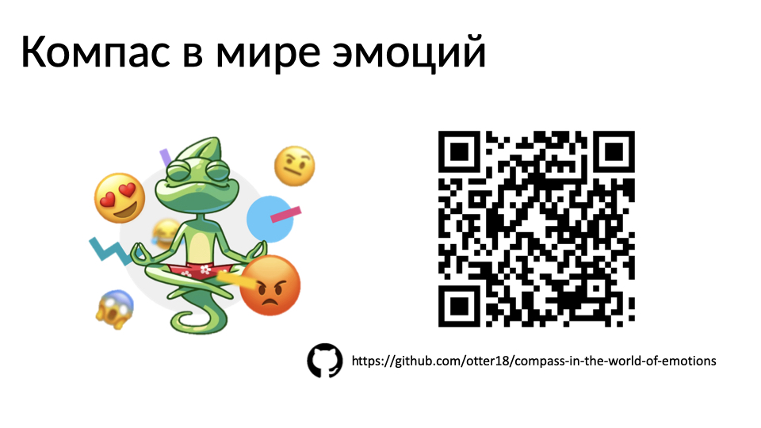
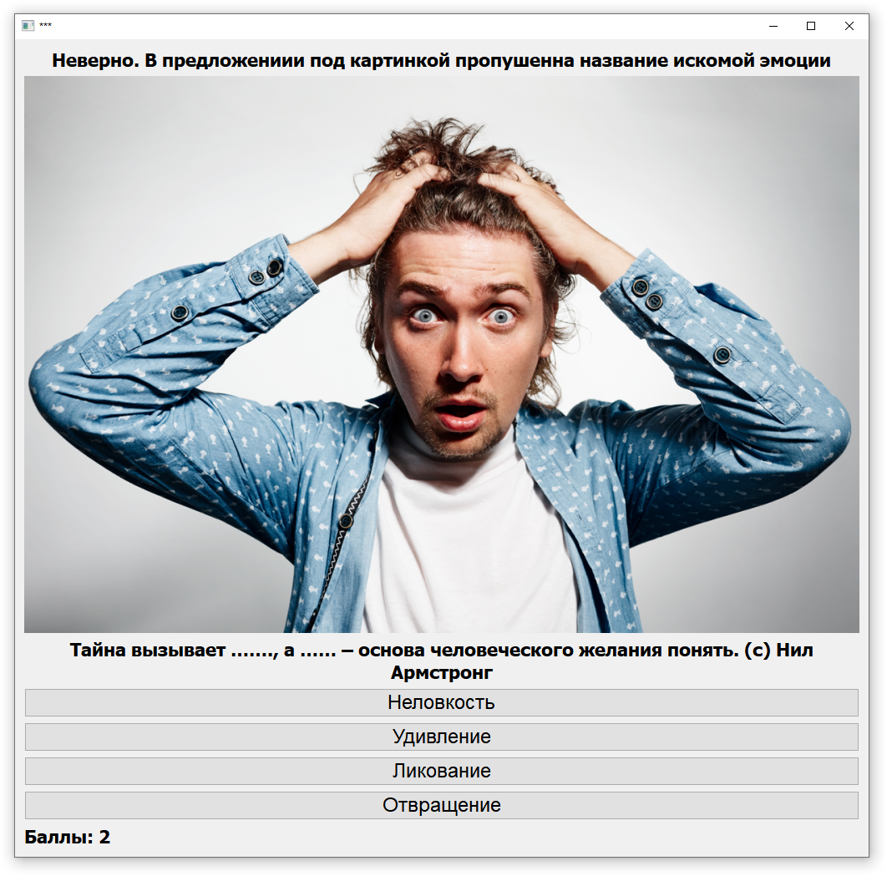
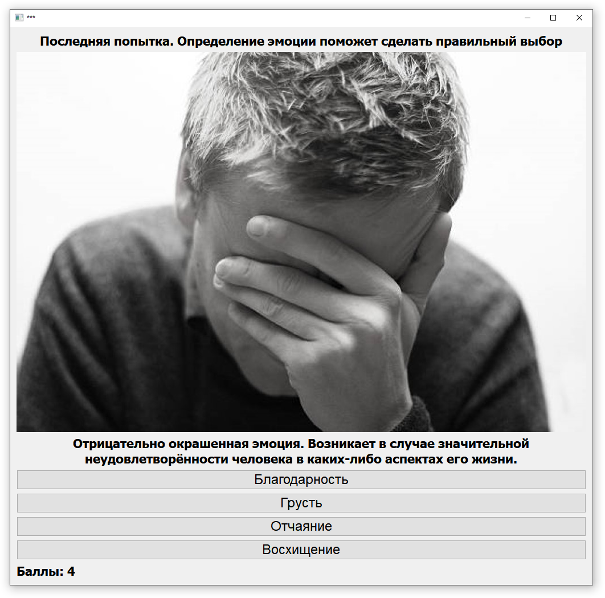

- В нашей жизни эмоциональный интеллект проявляется как способность чувствовать свои эмоции, уметь ими управлять, понимать эмоции других людей.
- Часто очень умные люди с высоким IQ, испытывают проблемы в общении и построении взаимоотношений из-за низкого уровня эмоционального интеллекта.
- Мне, как и многим моим ровесникам, довольно сложно распознавать и называть свои эмоции. Поэтому я придумал и написал на Python+PyQt5 простую компьютерную игру-тест, обучающую этому навыку.

# Как протестировать?
1) Скачать и установить <code> Python 3.x </code>
2) <code> pip install PyQt5 </code>
3) Скачать архив, извлечь все файлы на локальный диск
4) Запусть <code> main.py </code> из скаченной папки
5) Радоваться и наслаждаться
## Скриншоты

