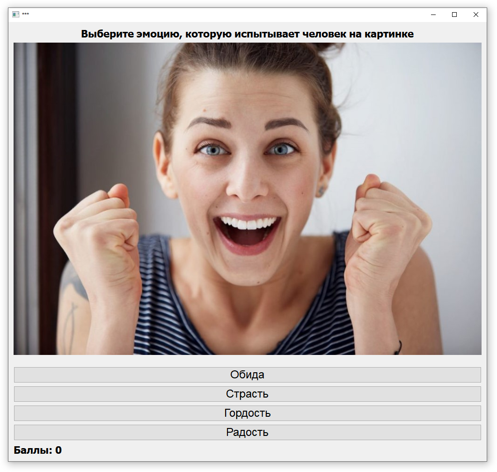

# Как протестировать?
1) Скачать и установить <code> Python 3.x </code>
2) <code> pip install PyQt5 </code>
3) Скачать архив, извлечь все файлы на локальный диск
4) Запусть <code> main.py </code> из скаченной папки
5) Радоваться и наслаждаться
## Скриншоты

